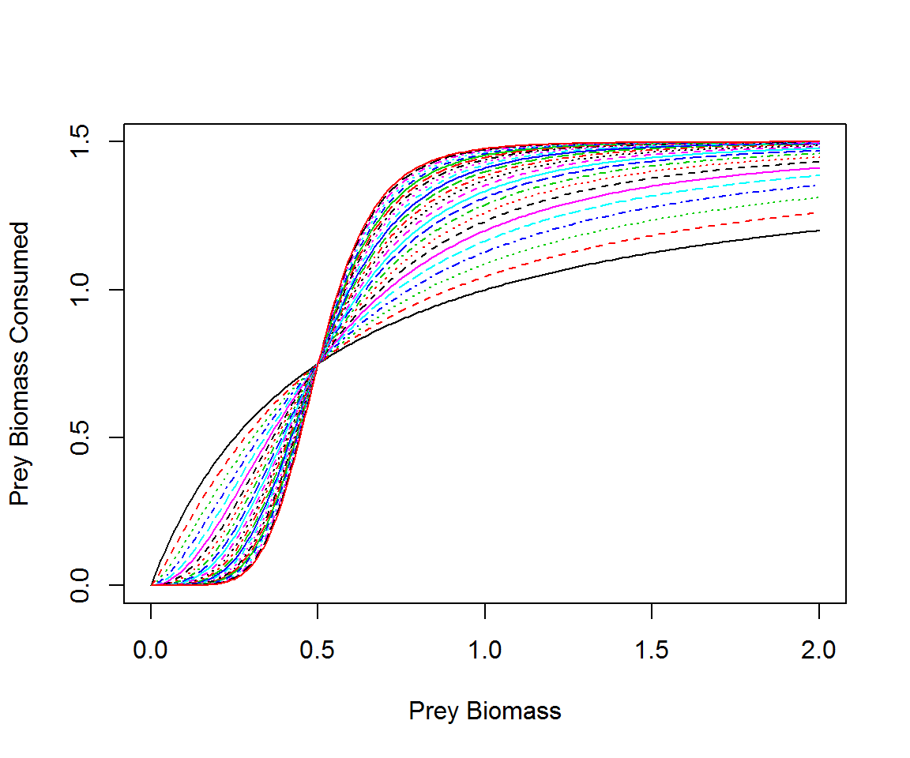
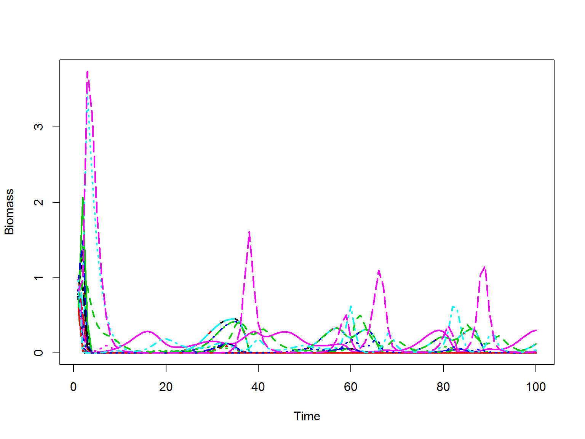

# Introduction 

## Purpose
To further explore the relationship between food web structure and dynamics. 

## Hypothesis
In previous work [@Borrelli2014; @Borrelli2015; @Borrelli2015a] I have asserted that observed food web structure emerges from the preferential loss of unstable configurations. This was supported by correlational evidence that the basic building blocks of food webs, short food chains and motifs, are also more likely to be stable than other potential building blocks of similar types (e.g., longer food chains or other three species subgraphs). 

This project seeks a more mechanistic approach, by simulating the dynamics of model food webs. Based on my prior work I suggest that the structure of the food web following extinction events (from simulated dynamics) will exhibit a higher proportion of stable components via loss of species that contribute to destabilizing building blocks.  

# The Model

I have borrowed a model of multispecies predator prey dynamics based on species biomass modified from Yodzis and Innes [-@Yodzis1992], that has been used in a number of publications. Specifically, I am using the form and parameterization suggested by Romanuk et al. [-@Romanuk2009] and Williams and Martinez [-@Williams2004]. 

$$
\frac{dB_i(t)}{dt} = G_i(B) - x_iB_i(t) + \sum_{j}^{n}\left(x_i y_{ij} F_{ij}(B) B_i(t) - x_j y_{ji} F_{ji}(B) B_j(t) / e_{ji} \right)
$$

The first term, $G_i(B)$, is the function describing primary production of producer species in the absence of predation. Producers grow exponentially with density dependence. 

$$
G_i(B) = r_i B_i(t) (1 - \frac{B_i(t)}{K_i})
$$

In the equation, $r_i$ is the intrinsic rate of increase, $B_i$ is the biomass of population _i_, and $K_i$ is the carrying capacity of population _i_.

This equation is represented in my code as: 

```r
G.i <- function(r, B, K) {
    return(r * B * (1 - (B/K)))
}
```
As in the equation `r` is the intrinsic rate of increase, `B` is biomass, and `K` is carrying capacity. 

The consumption of resource _j_ by consumer _i_ is modeled by: 
$$
F_{ij}(B) = \frac{B_j^{1+q}}{\sum_k B_k^{1+q} + B_0^{1+q}}
$$

Here, $B_j$ is the biomass of the consumed resource, in the denominator the summed biomass across all $k$ resources, and $B_0$ is the half saturation density. The parameter $q$ is a tuning parameter that lets the modeller shift the functional response between a type II ($q = 0$) and a type III ($q = 1$). The functional response above defines the fraction of a predator's maximal ingestion that is realized at a given time step. 

The functional response is represented in my code as: 

```r
Fij <- function(B, A, B.0, xpar) {
    sum.bk <- rowSums(sapply(1:nrow(A), function(x) {
        B[x] * A[x, ]
    }))^(1 + xpar)
    denom <- sum.bk + B.0^(1 + xpar)
    
    F1 <- sapply(1:nrow(A), function(x) {
        (B[x] * A[x, ])^(1 + xpar)
    })/denom
    
    return(F1)
}
```

The function takes in a vector of species' biomasses, the adjacency matrix defining species' interactions, the half saturation constant `B.0`, and the tuning parameter ($q$, here termed `xpar`). The first line of the function generates the summation in the denominator of the functional response, $\sum_k B_k^{1+q}$, and the second line gives the last part of the denominator. In the code, the denominator is a vector of length _N_ (number of species), were each element is the denominator of the corresponding species. The third line generates the numerator by assigning the biomass of the prey species to each interaction and raising it to `1+q` and at the same time completing the function by dividing each row of the matrix by the corresponding denominator. 

## Functional Response 

To test how the tuning parameter changes the shape of the functional response, I wrote a simple simulation to test how the biomass of prey eaten changes with the biomass of the prey species in a two species predator prey system defined by 0, 0, 1, 0. 

```r
K = 1
x.i = 0.5
yij = 6
xpar = 0
B.o = 0.5
A = matrix(c(0, 0, 1, 0), nrow = 2)
FR = Fij

prey <- seq(0, 2, 0.01)
pred <- 0.5
x <- seq(0, 5, 0.2)
eaten <- matrix(nrow = length(prey), ncol = length(x))
for (j in 1:length(x)) {
    for (i in 1:length(prey)) {
        states = c(prey[i], pred)
        eaten[i, j] <- rowSums((x.i * yij * FR(states, A, B.o, xpar = x[j]) * 
            states))[2]
    }
}
```
I ran the simulation using the same fixed parameter values I used in the full model based on Romanuk (2009), listed in Table 1. I tested a sequence of potential `q` values from `0` (Type I) to `5` (Type III with large prey refuge). The results are in Figure 1. 


```r
matplot(prey, eaten, typ = "l", xlab = "Prey Biomass", ylab = "Prey Biomass Consumed")
```



In this model, as I have understood it the impact of the predator on the prey is equivalent to the impact of the prey on the predator. Thus the numerical response of the predator is the same magnitude as the functional response of the prey but of the opposite sign. This is accomplished as $F_ji = t(F_ij)$.

## Full Model  

The full model is implemented in R using a differential equation solver, `ode` in the R package `deSolve`. The function input to the solver for numerical integration is: 


```r
conres <- function(t, states, par) {
    
    with(as.list(c(states, par)), {
        dB <- G.i(r = r.i, B = states, K = K) - x.i * states + rowSums((x.i * 
            yij * FR(states, A, B.o, xpar = xpar) * states)) - rowSums((x.i * 
            yij * t(FR(states, A, B.o, xpar = xpar) * states))/eij)
        
        list(c(dB))
    })
    
}
```

The function takes in a series of times (`t`), intitial states (biomasses in this case, `states`), and a list of parameter values. To input into the solver, I have written a wrapper function that allows me to modify the food web structure, specific parameters and functions, and create plots.   


```r
Crmod <- function(Adj, t = 1:200, G = G.i, method = conres, FuncRes = Fij, K = 1, 
    x.i = 0.5, yij = 6, eij = 1, xpar = 0.2, B.o = 0.5, plot = FALSE) {
    require(deSolve)
    
    grow <- get.r(Adj)
    
    par <- list(K = K, x.i = x.i, yij = yij, eij = 1, xpar = xpar, B.o = B.o, 
        r.i = grow, A = Adj, G.i = G, FR = FuncRes)
    
    states <- runif(nrow(Adj), 0.5, 1)
    
    out <- ode(y = states, times = t, func = method, parms = par, events = list(func = eventfun, 
        time = t))
    
    if (plot) 
        print(matplot(out[, -1], typ = "l", lwd = 2, xlab = "Time", ylab = "Biomass"))
    
    return(out)
}
```

In the `ode` function I have included an _event_ that occurs when a species biomass dips below a set threshold ($10^-10$) it goes extinct, and it's biomass is replaced with 0. The event takes the function: 


```r
eventfun <- function(times, states, parms) {
    with(as.list(states), {
        for (i in 1:length(states)) {
            if (states[i] < 10^-10) {
                states[i] <- 0
            } else {
                states[i]
            }
        }
        return(c(states))
    })
}
```

The function's inputs are the times going into the differential equation solver, the initial state variables, and the list of parameter values.

## Parameter Values  

Work by Williams and Martinez (2004) and Romanuk et al (2009) suggest that fixed values for a number of the required model parameters give similar dynamic results to drawing these parameter values from distributions with specified means and standard deviations. The suggested values are specified in the function above, and in Table 1 below. 


Table: Fixed parameter values for the dynamic model

Parameter    Value
----------  ------
K              1.0
x.i            0.5
yij            6.0
eij            1.0
xpar           0.2
B.o            0.5

## Model Run  

The first thing to do is generating a model food web on which I can generate the dynamics. For this example I will use a niche model food web. 


```r
niche.model <- function(S, C) {
    require(igraph)
    connected = FALSE
    while (!connected) {
        new.mat <- matrix(0, nrow = S, ncol = S)
        ci <- vector()
        niche <- runif(S, 0, 1)
        r <- rbeta(S, 1, ((1/(2 * C)) - 1)) * niche
        
        for (i in 1:S) {
            ci[i] <- runif(1, r[i]/2, niche[i])
        }
        
        r[which(niche == min(niche))] <- 1e-08
        
        for (i in 1:S) {
            
            for (j in 1:S) {
                if (niche[j] > (ci[i] - (0.5 * r[i])) && niche[j] < (ci[i] + 
                  0.5 * r[i])) {
                  new.mat[j, i] <- 1
                }
            }
        }
        
        new.mat <- new.mat[, order(apply(new.mat, 2, sum))]
        
        connected <- is.connected(graph.adjacency(new.mat))
    }
    return(new.mat)
}
```

I start with a niche model food web with `100` species and a connectance of `0.2`. Then I compute the initial whole web properties.  


```r
nm1 <- niche.model(S = 30, C = 0.1)
wp.in <- web_props(nm1)

kable(wp.in, format = "pandoc", caption = "Whole web properties of the initial niche model food web")
```


Table: Whole web properties of the initial niche model food web

  N          C   Ltot         LD       clust        apl   diam   bas   top
---  ---------  -----  ---------  ----------  ---------  -----  ----  ----
 30   0.116092    101   3.366667   0.1089259   2.378757      6    10     0

The next step is to use the model to simulate the dynamics of the food web. This function will output a table of biomasses at each time step. 


```r
dyn2 <- Crmod(Adj = nm1, t = 1:100, G = G.i, method = conres, FuncRes = Fij, 
    K = 1, x.i = 0.5, yij = 6, eij = 1, xpar = 0.2, B.o = 0.5, plot = F)
matplot(dyn2[, -1], typ = "l", lwd = 2, xlab = "Time", ylab = "Biomass")
```



The dynamics of the web can be visualized through time: 


# Getting Results  

I want to know how population dynamics based extinctions alters the structure of the food web. To do that I need to be able to compare the initial and final food webs. 

## Functions
The `web_props` function below takes the adjacency matrix and computes several network properties: the number of species (`N`), the connectance (`C`, $\frac{L}{N*(N-1)}$), number of links (`Ltot`), link density (`LD`), clustering coefficient (`clust`), modularity (`mod`), average path length (average food chain length, `apl`), diameter (longest shortest food chain, `diam`), number of basal species (`bas`), and number of top predators (`top`).


```r
web_props <- function(mat) {
    require(NetIndices)
    require(modMax)
    
    N <- nrow(mat)
    C <- sum(mat)/(nrow(mat) * (nrow(mat) - 1))
    
    genind <- GenInd(mat)
    Ltot <- genind$Ltot
    LD <- genind$LD
    
    g <- graph.adjacency(mat)
    
    clust <- transitivity(g)
    apl <- average.path.length(g)
    diam <- diameter(g)
    
    bas <- sum(degree(g, mode = "in") == 0)
    top <- sum(degree(g, mode = "out") == 0)
    
    mod <- simulatedAnnealing(mat, fixed = 1000)
    
    df <- data.frame(N, C, Ltot, LD, clust, mod = mod$modularity, apl, diam, 
        bas, top, mot)
    return(df)
}
```

I also want to know how the motif structure of the network changes after extinctions. The `motif_counter` function (same that I used in Borrelli (2015)), gives the number of each of the three species subgraphs in the network.  


```r
motif_counter <- function(graph.lists) {
    require(igraph)
    
    if (!is.list(graph.lists)) {
        stop("The input should be a list of graph objects")
    }
    
    triad.count <- lapply(graph.lists, triad.census)
    triad.matrix <- matrix(unlist(triad.count), nrow = length(graph.lists), 
        ncol = 16, byrow = T)
    colnames(triad.matrix) <- c("empty", "single", "mutual", "s5", "s4", "s1", 
        "d4", "d3", "s2", "s3", "d8", "d2", "d1", "d5", "d7", "d6")
    
    triad.df <- as.data.frame(triad.matrix)
    
    motif.data.frame <- data.frame(s1 = triad.df$s1, s2 = triad.df$s2, s3 = triad.df$s3, 
        s4 = triad.df$s4, s5 = triad.df$s5, d1 = triad.df$d1, d2 = triad.df$d2, 
        d3 = triad.df$d3, d4 = triad.df$d4, d5 = triad.df$d5, d6 = triad.df$d6, 
        d7 = triad.df$d7, d8 = triad.df$d8)
    
    return(motif.data.frame)
}
```

Because it is not worthwhile to compare the counts of motifs in initial and final networks (the difference in number of species and connectance precludes direct comparison), I wrote a function to compare the motif count in the final network to networks of the same size created by assuming random extinctions. For example, if the final network has 30 species, and the initial food web had 100, I create _n_ random adjacency matrices with 30 of the initial 100 species chosen at random. 


```r
rel.rand <- function(mat, n, iter = 10000) {
    require(igraph)
    rands <- list()
    for (i in 1:iter) {
        spp <- sample(1:nrow(mat), n)
        rands[[i]] <- mat[spp, spp]
    }
    rands.g <- lapply(rands, graph.adjacency)
    mot <- motif_counter(rands.g)
    return(mot)
}

rel.rand.z <- function(mat, dyn, iter = 10000) {
    m1 <- motif_counter(list(graph.adjacency(mat[which(tail(dyn, 1)[-1] > 0), 
        which(tail(dyn, 1)[-1] > 0)])))
    n <- sum(tail(dyn, 1)[-1] > 0)
    m2 <- rel.rand(mat = mat, n = n, iter = iter)
    
    zscore <- (m1 - colMeans(m2))/apply(m2, 2, sd)
    
    return(zscore)
}
```


## Analysis


```r
CRmod.gen <- function(S, con, network, xpar, ...) {
    # create model network
    if (network == "niche") {
        amat <- niche.model(S = S, C = con)
    }
    if (network == "erdosrenyi") {
        ag <- erdos.renyi.game(n = S, p.or.m = con, type = "gnp", directed = T)
        amat <- get.adjacency(ag, sparse = F)
    }
    
    # dynamic model
    
    dyn1 <- Crmod(Adj = amat, t = 1:500, G = G.i, method = conres, FuncRes = Fij, 
        K = 1, x.i = 0.5, yij = 6, eij = 1, xpar = xpar, B.o = 0.5, plot = FALSE)
    
    # get motif scores
    
    amat2 <- amat[which(tail(dyn1[, -1], 1) > 0), which(tail(dyn1[, -1], 1) > 
        0)]
    
    # z1 <- data.frame(time = factor('init'), get.zscore(amat)) z2 <-
    # data.frame(time = factor('final'), get.zscore(amat2)) return(rbind(z1,
    # z2))
    
    z <- rel.rand.z(amat, dyn1, iter = 10000)
    wp <- cbind(melt(web_props(amat), variable.name = "property", value.name = "initial"), 
        final = melt(web_props(amat2))[, 2])
    
    return(list(wp = wp, z = z))
}
```


```r
require(doSNOW)
require(parallel)
require(data.table)

# make the cluster
cl <- makeCluster(detectCores() - 1)
registerDoSNOW(cl)

RESULTS <- foreach(i = 1:100) %dopar% {
    source("./Rscripts/MODELfunctions.R")
    test <- CRmod.gen(60, 0.1, modTYPE[i], xpar = 1)
    test2 <- CRmod.gen(60, 0.1, modTYPE[i], xpar = 0.2)
    # z.results <- data.frame(model = modTYPE[i], q = 1, iter = i, test$z)
    # z.results2 <- data.frame(model = modTYPE[i], q = .2, iter = i, test2$z)
    z.res <- data.frame(model = rep(modTYPE[i], 2), q = c(1, 0.2), iter = c(i, 
        i), rbind(test$z, test2$z))
    
    # results <- data.frame(model = modTYPE[i], q = 1, iter = i, test$wp)
    # results2 <- data.frame(model = modTYPE[i], q = .2, iter = i, test2$wp)
    res <- data.frame(model = rep(modTYPE[i], 2), q = rep(c(1, 0.2), each = 10), 
        iter = rep(i, 20), rbind(test$wp, test2$wp))
    
    return(list(z.res, res))
}

stopCluster(cl)

z1 <- rbindlist(lapply(RESULTS, "[[", 1))
z2 <- melt(z1, id.vars = c("model", "q", "iter"), variable.name = "motif")
z2$value[is.na(z2$value)] <- 0
r1 <- rbindlist(lapply(RESULTS, "[[", 2))

ggplot(z2, aes(x = motif, y = value, fill = factor(q))) + geom_boxplot() + geom_line(aes(x = as.numeric(motif), 
    y = 2)) + facet_wrap(~model)

ggplot(r1, aes(x = initial, y = final, col = model)) + geom_point() + geom_abline(slope = 1, 
    intercept = 0) + facet_wrap(~property, scales = "free")
# z.all <- melt(rbindlist(z.results), id.vars = c(1,2)) z.all2 <-
# melt(rbindlist(z.results2), id.vars = c(1,2)) wp.all <- rbindlist(results)
# wp.all2 <- rbindlist(results2)

# ggplot(rbind(z.all, z.all2), aes(x = variable, y = value, fill =
# factor(q))) + geom_boxplot()
ggplot(rbind(wp.all, wp.all2), aes(x = initial, y = final, fill = factor(q))) + 
    geom_point() + facet_wrap(~property, scales = "free")
```

# References
